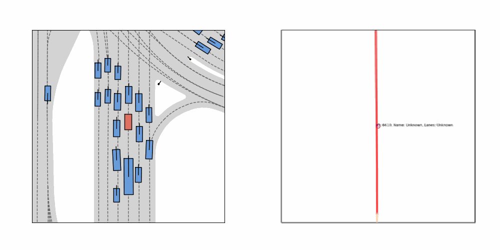
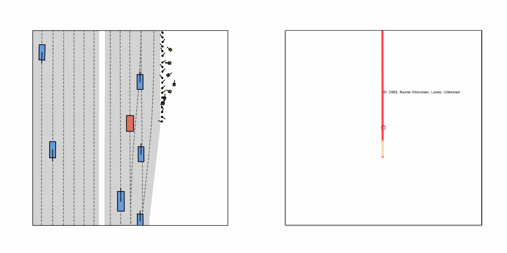

<div align="center">
<h2>Understanding Driver Intention: Enhancing IL Planning with Navigation Path Fusion</h2>

 **Leichen Wang**<sup>1</sup>, **Ziming Liu**<sup>1</sup>, **Ge Yang**<sup>1</sup>, **Yuheng Zhou**<sup>2</sup>, **Xinrun Li**<sup>1</sup>, **Xingtao Hu**<sup>1</sup>, **Ge Yang**<sup>1</sup>, **Dashan Guo**<sup>2</sup>, **Cong Wang**<sup>2</sup>, **Hao Sun**<sup>1</sup>, **Lei La**<sup>2</sup>, **Kevin Sun**<sup>2</sup>, **Lijuan Zhu**<sup>1</sup>, **Jian Zhou**<sup>2</sup>, <br>

<sup>1</sup>Bosch Research & Technology Center Asia Pacific, Shanghai, China, <sup>2</sup>Bosch Automotive Products (Suzhou) Co., Ltd.

> **Submitted to IROS 2025**

</div>

<!-- >
[\[Arxiv\]](https://arxiv.org/abs/2401.06614) [\[Paper\]](https://arxiv.org/pdf/2401.06614.pdf) [\[Project Page\]](https://[vveicao.github.io/projects/Motion2VecSets/](https://github.com/xiaowang12345/OMG_SD_map_prior_distribution))
-->

---

## 🚗 Overview

Recent advancements in imitation learning (IL)-based planning for autonomous driving have shown impressive scalability. However, existing approaches often struggle with **mode collapse** or **directional deviations**, resulting in plans that fail to align with human driving intentions.

### 🔎 What's Missing?  
A critical gap lies in the **lack of explicit modeling of navigation paths**, leading to **causal misidentification** in planning tasks. Navigation paths provide high-level guidance that humans intuitively follow—but most E2E planners ignore this essential component.

---

### Comparison of NAVSIM Trajectory and Recovered Navigation Path

The table below presents a comparative visualization of `NAVSIM` trajectories and our recovered navigation path.


| **Scenario**                   | **Visualization (NAVSIM vs. Navigation Path)**                         |
|---------------------------------|-----------------------------------------------------------------------------|
| **Go Straight** |  |
| **Left Turn**          |  |
| **Right Turn** |  |
| **Sharp Turn** |  |

---
## 📦 Dataset Release

We release our extended datasets for **NavSim** to support the community in research on navigation-path-enhanced planning.

### 🔗 Download Links

- **[nav_path_trainval.zip](https://drive.google.com/file/d/1gu2c1OYXH6vuE0n0E1a34Zmlw1BLpMuH/view?usp=drive_link)**  
  Navigation path annotations for **training** and **validation** (NavSim benchmark).
  
- **[nav_path_test.zip](https://drive.google.com/file/d/1qfidsuZKyWAW8Cn955OtO03UbWRi-1XD/view?usp=drive_link)**  
  Navigation path annotations for **testing** (NavSim benchmark).

### 📁 Dataset Structure


After extraction, each archive contains four subfolders corresponding to different cities:

nav_path_trainval/
├── sg-one-north/
├── us-ma-boston/
├── us-nv-las-vegas-strip/
└── us-pa-pittsburgh-hazelwood/

nav_path_test/
├── sg-one-north/
├── us-ma-boston/
├── us-nv-las-vegas-strip/
└── us-pa-pittsburgh-hazelwood/

---
### Qualitative Results 

The figure below compares the original **Diffusion Drive** and our **navigation-path-enhanced Diffusion Drive** on challenging scenes from the **NAVSIM navtest split**. It demonstrates how navigation paths influence anchor trajectories across different driving scenarios.


<p align="center">
    
</p>

---
## Citation
If you find our paper or dataset is helpful in your research or development, please consider giving us a star and citing our work.

```bibtex

```