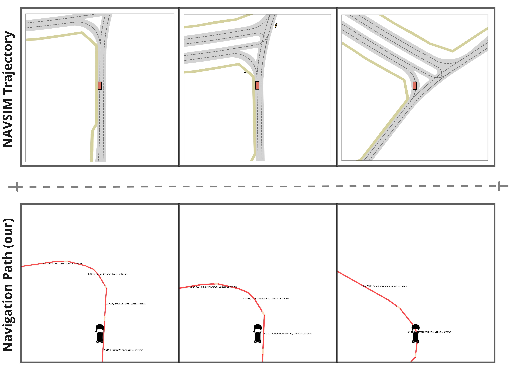
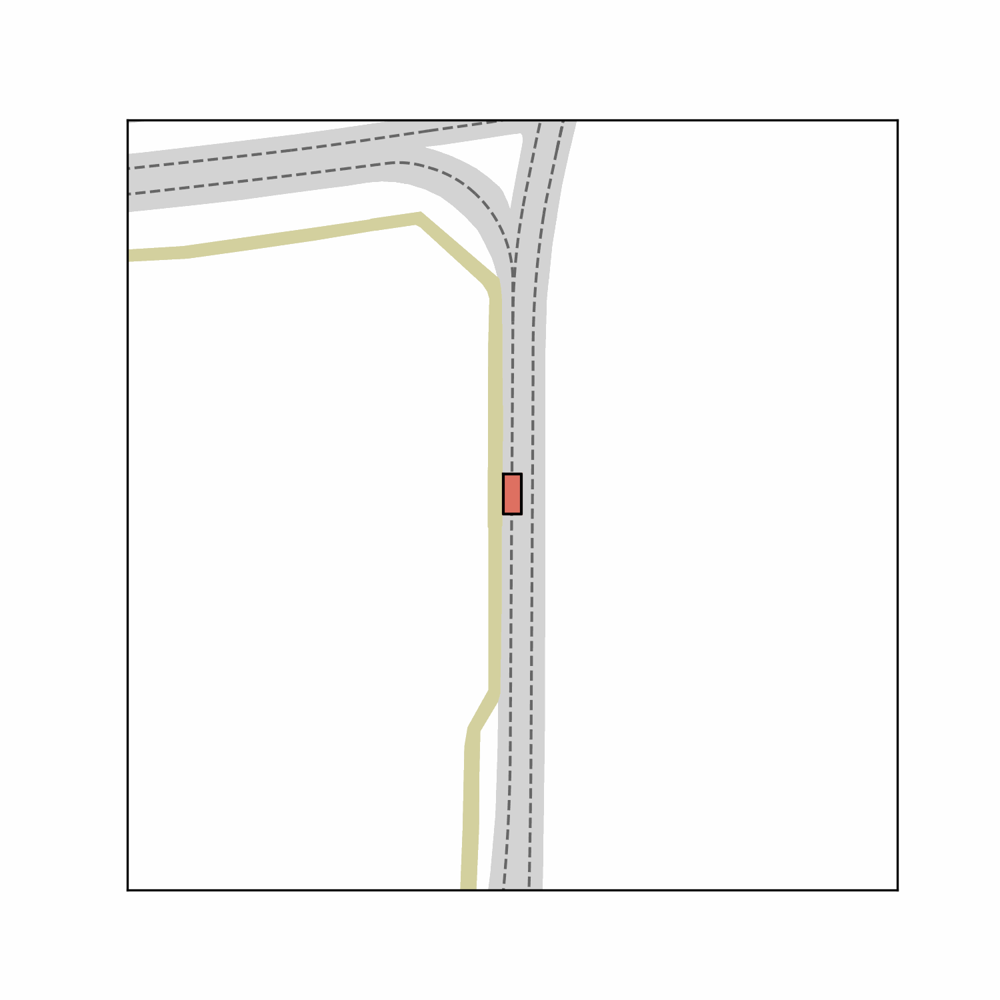
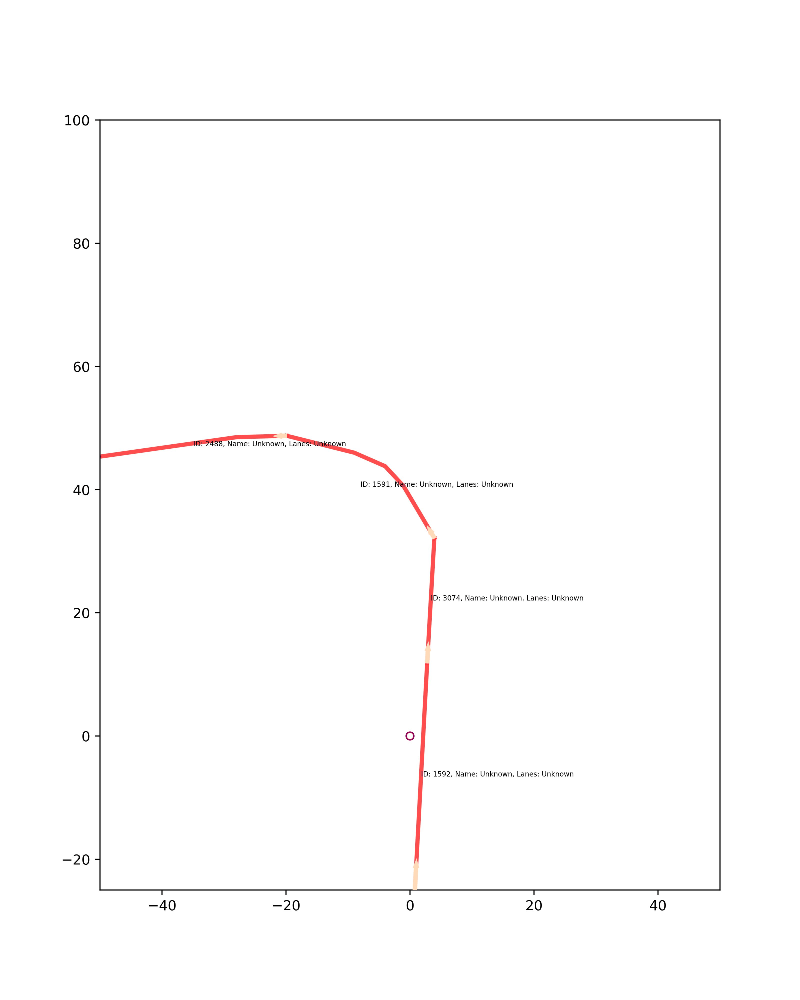

<h2>Understanding Driver Intention by Navigation Path guided AI planning</h2>

 **Leichen Wang**1 ·**Ziming Liu**1 · **Ge Yang**1 · **Xingtao Hu**1 · **Xinrun Li**1  

1Bosch Corporate Research  

<!-- > **submitted to IROS 2025** -->

<!-- >
[\[Arxiv\]](https://arxiv.org/abs/2401.06614) [\[Paper\]](https://arxiv.org/pdf/2401.06614.pdf) [\[Project Page\]](https://[vveicao.github.io/projects/Motion2VecSets/](https://github.com/xiaowang12345/OMG_SD_map_prior_distribution))
-->

Recent advancements in learning-based planning for autonomous driving have demonstrated promising scalability, yet they often suffer from mode collapse or directional deviations, failing to align with human driving intentions.  We identify a critical gap in existing frameworks: the lack of explicit modeling of navigation paths, leading to causal misidentification in planning tasks.  Inspired by human driving behavior, where navigation paths provide high-level guidance, we propose a novel approach that integrates navigation paths as a guide for trajectory planning.  We introduce two versatile frameworks tailored for anchor-based and non-anchor-based methods, addressing the limitations of current systems.  Additionally, we develop a toolchain for automatic navigation path generation and release an extended dataset with navigation annotations.  Extensive evaluations on the extended NavSim benchmark \textit{ and a newly collected driving dataset} demonstrate significant improvements in planning accuracy and safety, showcasing the robustness and transferability of our approach.

We argue that this omission is fundamentally unreasonable. Navigation paths are not only readily available in real-world autonomous driving systems, but they also provide a direct and interpretable way to guide the planning process. Incorporating navigation paths into E2E frameworks offers a straightforward yet powerful solution to the problem of directional deviations in trajectory planning.

To address these challenges and limitations, we propose a new planning methodology titled \textbf{Make E2E Driving Easy Again} A Simple Yet Effective Navigation Path Enhanced Planning Framework. This work builds on the strengths of existing E2E frameworks while addressing their shortcomings by explicitly incorporating navigation paths as a guiding prior for planning.

---

### Comparison of NAVSIM Trajectory with our recovered Navigation Path
The following images illustrate a comparison of the visualization of trajectories from NAVSIM with our recovered navigation path based on HMM-algorithm:

---

#### Scenario 1 (map location: SG-One-North):

    

---

## Animated Comparison

### Description of Scenarios

1. **Left Turn Scenario**: Demonstrates the behavior of the navigation system in a simple left-turn environment.
2. **Right Turn and Straight Movement Scenario**: Showcases the navigation through a combination of right turn and straight road sections.
3. **Continuous Left Turns Scenario**: Tests the navigation system's capability to handle multiple consecutive left turns.
4. **Roundabout Scenario**: Evaluates navigation performance within a roundabout environment.

### Comparison Table

- **Left GIF**: NAVSIM Trajectory  
- **Right GIF**: Navigation Path  

| **Scenario**                   | **NAVSIM Trajectory**                                       | **Navigation Path**                                       |
|---------------------------------|------------------------------------------------------------|----------------------------------------------------------|
| **Left Turn Scenario**          |  |  |
| **Right Turn and Straight Movement Scenario** |  |  |
| **Continuous Left Turns Scenario** |  |  |
| **Roundabout Scenario**         |  |  |

---
